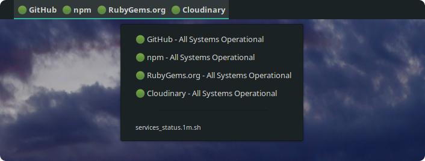

# argos-plugins

This is my personal collection of [Argos](https://github.com/p-e-w/argos/) plugins ([Bitbar](https://github.com/matryer/bitbar) for OS X, if you're into that).

| Name | Description | Configuration | Screenshot |
|-|-|-|-|
| Wakatime | Displays time spent today from the Wakatime API | If you already have Wakatime installed, this script will fetch your API key from your `$HOME/.wakatime.cfg` config file. |  |
| Services Status | Shows status of a selection of services from statuspage.io | None, the default service selection is Github, npm, RubyGems, and Cloudinary. |  |
